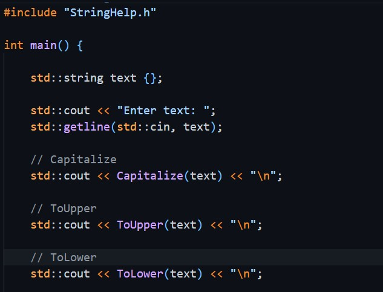
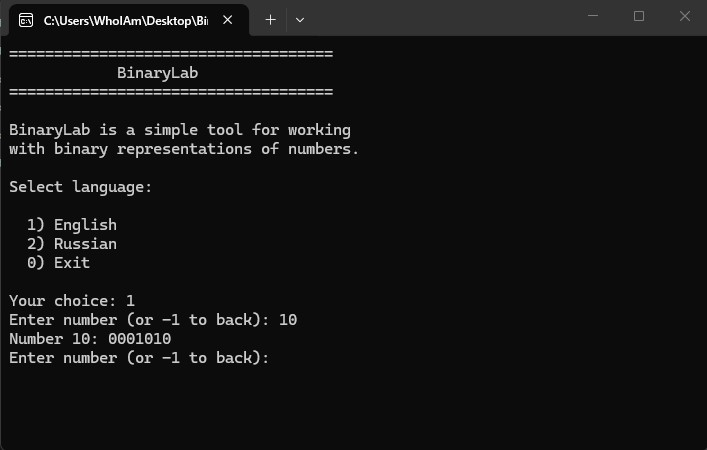
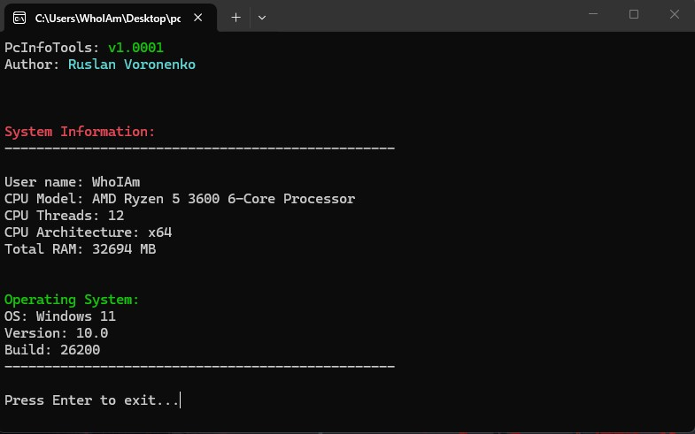

<!--  -->

  

  
  
  
   
  
  

 

## 🌟 About Me

 

💻 I specialize in C++ development.  
🧠 Experienced with low-level programming, memory management, and pointer arithmetic in C++. 
🚀 Continuously learning and improving my skills. 
🌍 Interested in open source and software architecture. 

 

 

## 💻 Programming Languages:

 

## 🐍 Scripting & Automation:

 

## 🗄 Data & Formats:

 

 

## 🔧 Tools:

 

 

## 🖥 Environments:

 

---

## 📈 Contribution Activity:

<!-- Streak stats -->

  

<!--  -->

<!-- Table portfolio -->

<!-- | 💻 Language | 🧾 Description | 🔗 Link |
|------------|----------------|--------|
|| A lightweight C++ library for string manipulation, including uppercase, lowercase, and capitalization.  | https://github.com/RusProgger/StringHelp |
|| BinaryLab is a simple console tool for working with binary representations of numbers. This project was created as part of learning low-level programming concepts in C++ and computer graphics fundamentals.  | https://github.com/RusProgger/BinaryLab |
|| This is a C++ console application that retrieves and displays basic information about the computer using WinAPI.  | https://github.com/RusProgger/pcInfoTools |
 -->

 ## 💼 Portfolio:

 ### 📚 StringHelp

Lightweight C++ library for string manipulation.

**Tech**
`C++` `STL`

🔗 https://github.com/RusProgger/StringHelp

---

### 🔢 BinaryLab

Console application for studying binary numbers, bitwise operations and low-level programming.

**Tech**
`C++`

🔗 https://github.com/RusProgger/BinaryLab

---

### 🖥️ pcInfoTools

Windows console application using WinAPI to display system information.

**Tech**
`C++` `WinAPI`

🔗 https://github.com/RusProgger/pcInfoTools

 

