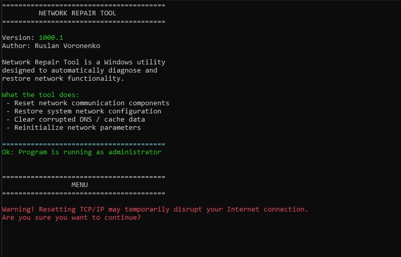
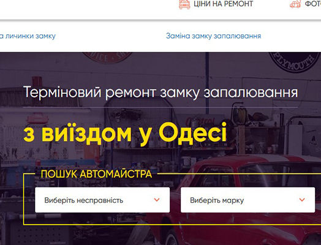
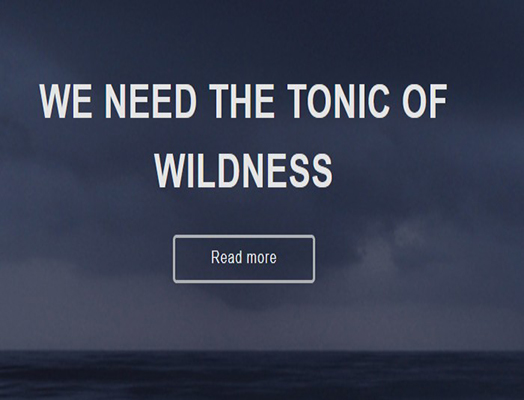

<!--  -->

  

  
  
  
   
  
  

 

## 🌟 About Me

 

💻 I specialize in C++ development.  
🧠 Experienced with low-level programming, memory management, and pointer arithmetic in C++. 
🚀 Continuously learning and improving my skills. 
🌍 Interested in open source and software architecture. 

 

 

## 💻 Programming Languages:

 

## 🌐 Front-end Development:

 

## 🗄 Database:

 

 

## 🔧 Tools:

 

 

## 🛠️ Additional Tools:

  

  
  
  

 

## 🖥 Environments:

 

## 📈 Contribution Activity:

<!-- Streak stats -->

<!-- 

  

 -->

<!--  -->

<!--  -->

<!-- Table portfolio -->

<!-- | 💻 Language | 🧾 Description | 🔗 Link |
|------------|----------------|--------|
|| A lightweight C++ library for string manipulation, including uppercase, lowercase, and capitalization.  | https://github.com/RusProgger/StringHelp |
|| BinaryLab is a simple console tool for working with binary representations of numbers. This project was created as part of learning low-level programming concepts in C++ and computer graphics fundamentals.  | https://github.com/RusProgger/BinaryLab |
|| This is a C++ console application that retrieves and displays basic information about the computer using WinAPI.  | https://github.com/RusProgger/pcInfoTools | -->

## 💼 Portfolio:

### 🧩 What I Build

 

 

## 💻 C++ Projects

Native applications, utilities and libraries built with C++.

 

<table> <tr>

<td width="50%" valign="top" align="center">

### 🔤 StringHelp

Lightweight C++ string utility library

Useful functions for string transformation, including uppercase, lowercase and capitalization.

  

</td>

<td width="50%" valign="top" align="center">

### 🔢 BinaryLab

Binary representation & low-level programming tool

A lightweight console application for working with binary representations of numbers.

  

</td>

</tr>

<tr>

<td width="50%" valign="top" align="center">

### 🖥️ pcInfoTools

Windows system information utility

A native Windows console application for collecting and displaying system information using WinAPI.

  

</td>

<td width="50%" valign="top" align="center">

### 🌐 NetworkRepairTool

Windows network diagnostics & repair utility

Designed to diagnose common network problems and restore connectivity by repairing network configuration.

  

</td>

</tr> </table>

 <!-- End div -->

 

<!-- html -->

---

### 🌐 Web Projects

Frontend interfaces and web applications built with modern web technologies.

 

<table>
<tr>

<td width="50%" valign="top" align="center">

### 🖥️ Automaster

Modern responsive web interface.

  

&nbsp;

</td>

<td width="50%" valign="top" align="center">

### 🌐 Car mersbens

Responsive frontend project with modern UI.

  

&nbsp;

</td>

</tr>

<!-- cols 2 -->

<tr>
<td width="50%" valign="top" align="center">

### 🌐 BlackSea

Responsive frontend project with modern UI.

  

&nbsp;

</td>

<td width="50%" valign="top" align="center">

### 🌐 Cloud

Responsive frontend project with modern UI.

  

&nbsp;

</td>

</tr>

<!-- end 2 cols -->

</table>

